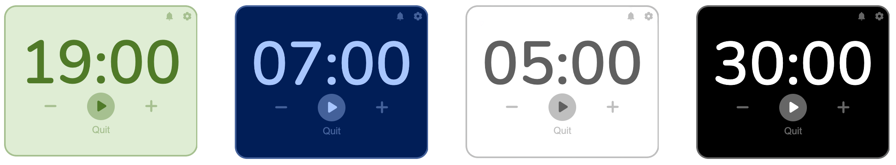

# Timer Widget
A simple timer widget to customise and embed.

## Features
- Simple timer: start/pause/quit timer
- Notification sound on/off
- Add/subtract minutes from the timer duration
- Customise: timer default duration, background colour, text colour (secondary colours are based on it)
- Customise button directly in the widget (redirects to the customisation interface).
Note that you cannot edit directly your current widget, you will have to start from scratch. Your widget settings value can be found in your widget URL.

## How to set up

 - Go to the [customisation
   interface](https://ozeily.github.io/Timer-widget/) to customise the
   widget
  - Click on the "Copy URL" button
  - Paste the URL where you want to embed it

**For Notion**: create an embed block, and paste the URL in the "embed a link" window. Resize the widget like any image/file in Notion.
At some point, the widget cannot be resized smaller. Use columns and resize them to make the widget even smaller (not recommended for your own experience)
**For HTML/Obsidian**: paste this in your HTML/Obsidian note

    <iframe src="(widget link)" width="(width)" height="(height)></iframe>
replace `(widget link`) with the provided URL
replace `(width)` and `(height)` with the desired dimensions, the widget will automatically adapt its content size depending on them.

